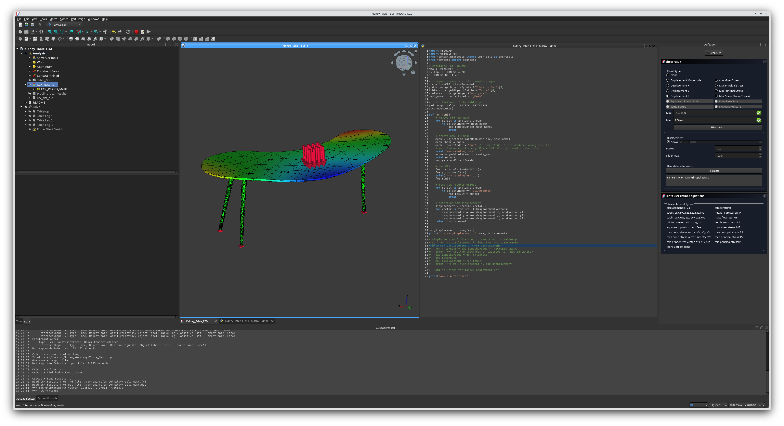

# Kidney Table

This project demonstrates how to use FreeCAD's FEM workbench via its Python API in a macro to iteratively determine the optimal thickness of a tabletop, ensuring that its displacement remains within a given limit.

